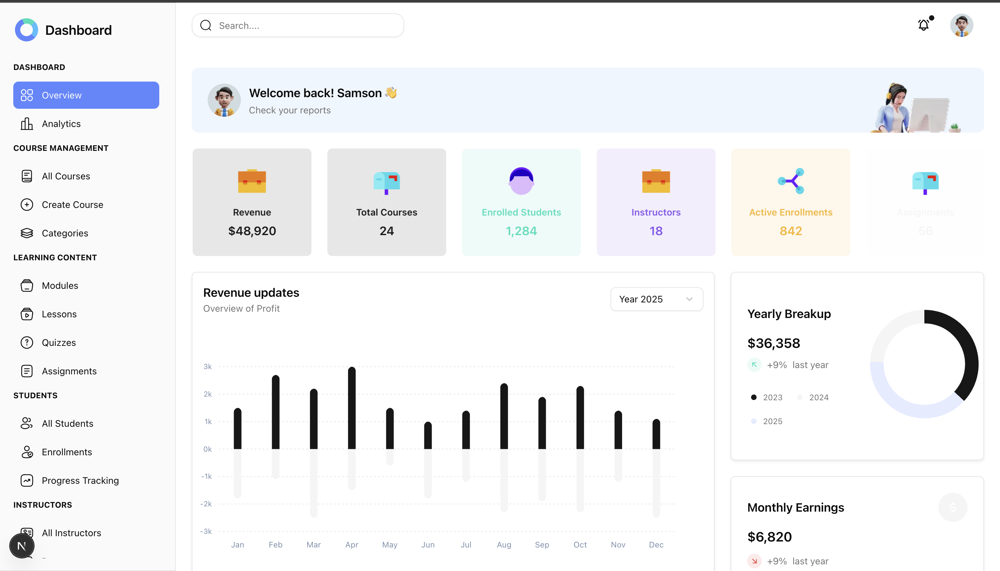

# LMS Platform — Next.js 15 + Tailwind v4 + shadcn

A modern, scalable, feature-based Learning Management System (LMS) built with **Next.js (App Router)**, **Tailwind CSS v4**, and **shadcn/ui**.

Designed for:

-  Schools & Universities  
-  Instructors  
-  Organizations  
-  SaaS LMS Platforms  

---

##  Tech Stack

| Layer | Technology |
|-------|------------|
| Framework | Next.js (App Router) |
| Styling | Tailwind CSS v4 |
| UI Components | shadcn/ui |
| Carousel | Swiper.js |
| Icons | Iconify |
| State | React Hooks / Server Components | 
| Architecture | Feature-based structure  |

---

##  Project Structure (Feature-Based Architecture)

```bash
src/
│
├── app/ # Next.js App Router
│ ├── (dashboard)/ # Dashboard layout group
│ ├── (auth)/ # Authentication pages
│ ├── courses/
│ ├── students/
│ ├── instructors/
│ ├── assignments/
│ ├── finance/
│ └── layout.tsx
│
├── features/
│ ├── courses/
│ │ ├── components/
│ │ ├── hooks/
│ │ ├── services/
│ │ ├── types.ts
│ │ └── index.ts
│ │
│ ├── students/
│ ├── instructors/
│ ├── assignments/
│ ├── certificates/
│ └── dashboard/
│
├── shared/
│ ├── components/
│ ├── ui/ # shadcn components
│ ├── lib/
│ ├── hooks/
│ └── utils/
│
├── styles/
│ ├── app.css
│ ├── layouts/
│ └── overrides/
│
└── public/
└── images/
```


---

##  Architecture Principles

- ✅ Feature-first folder structure  
- ✅ Separation of UI and business logic  
- ✅ Scalable for multi-role systems  
- ✅ Role-based navigation  
- ✅ Reusable design tokens  

---


## 📸 Screenshots

### 🏠 Dashboard



##  Core LMS Modules

###  Dashboard
- Overview
- Analytics
- KPI Cards
- Activity Feed

###  Course Management
- Create & Edit Courses
- Modules & Lessons
- Categories
- Media Upload

###  Students
- Enrollments
- Progress Tracking
- Course Completion
- Certificates

###  Instructors
- Course Assignment
- Revenue Tracking
- Payouts

###  Assessments
- Quizzes
- Assignments
- Submissions
- Grading System

###  Finance
- Transactions
- Plans & Pricing
- Coupons
- Revenue Analytics

###  Administration
- User Management
- Roles & Permissions
- System Settings

---

## Role-Based Access Model

The system supports:

- Super Admin

- Platform support

- Platorm finance

- Content Admin

- Instructor

- Organization Admin

- Organization Manager

Sidebar items and routes can be filtered by role:

```bash
roles?: ('admin' | 'instructor' | 'student')[]

```

## Installation

```bash
git clone https://github.com/psalmsin1759/lms_dashboard.git

cd lms_dashboard

npm install

```

## Run Development Server
```bash
npm run dev
```

### visit
```bash
http://localhost:3000
```

### Build for Production
```bash
npm run build
npm start

```

### Environment variable

```bash
NEXT_PUBLIC_APP_URL=http://localhost:3000
DATABASE_URL=
NEXTAUTH_SECRET=
```

### Dashboard Example (LMS Metrics)

- Top cards include:

- Total Courses

- Enrolled Students

- Instructors

- Active Enrollments

- Assignments

- Certificates Issued

- Pending Reviews

- Revenue


### Performance Optimizations

- App Router with Server Components

- Feature-based code splitting

- Minimal global CSS

- Optimized images via next/image


### Security Considerations

- Role-based route guards

- API validation

- CSRF protection

- Secure session handling

- Environment variable isolation